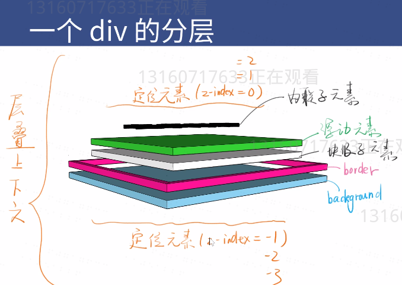

# position:absolute

  * 使用场景
  
    ✔脱离原来的位置，另起一层比如对话框的关闭按钮

    ✔鼠标提示
  * 配合z-index
  * 经验
  
    ✔很多彩笔都以为absolute是相对于relative定位的(正确的应该是相对于祖先原始中最近的祖先元素)

    ✔某些浏览器上如果不写top/left会位置错乱

    ✔善用left：100%
    ✔善用left:50%;加负margin

  * position:relative; 
    
    是相对于自己的偏移，位置不变，显示变了
     

  

# position:fixed
  
  fixed视口定位 ,注意，如果他 的父元素上有transform属性那么他fixed 就失效。手机上不要用这个属性很多问题，搜索移动端fixed，用了就996

# 层级上下文排序

* 比喻

  ✔每个层叠上下文就是一个新的小世界（作用域）

  ✔这个小世界里面第Z-index跟外界无关

  ✔处在同一个小世界的z-index才能比较

* 那些不正交的属性可以创建它

  ✔MDN文档有写

  ✔需要记忆的有z-index/flex/opacity/transform

  ✔知道这些第面试官不多，不用背，忘记了搜 【层叠上下文MDN】 

* Z-index =-1 不一定能逃出一个div，除非这个DIV不是层级上下文
  
  ✔记住负Z-index逃不出小世界，除非这个div没有层级上下文
  
   
 
  
